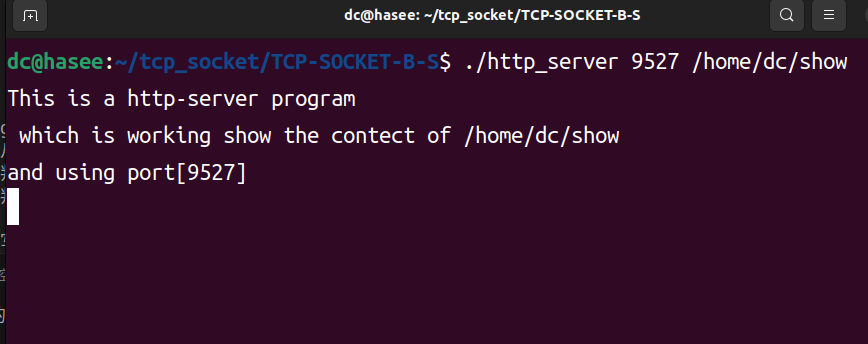
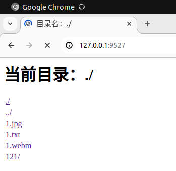
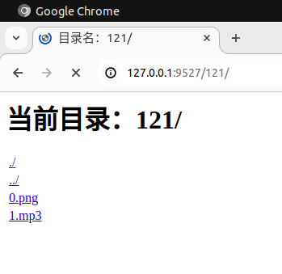
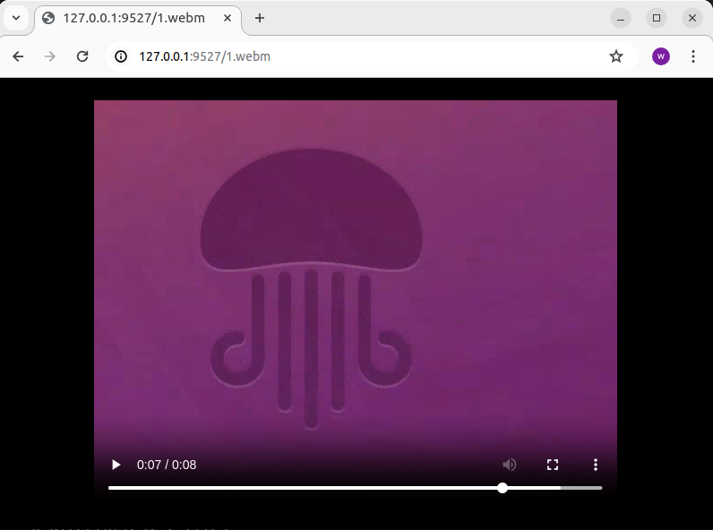

# TCP-SOCKET-B-S介绍
_TCP面向连接 Browser/Server（浏览器/服务器）模型_

```
.
├── example1.jpg
├── example2.jpg
├── example3.jpg
├── example4.jpg
├── http_server
├── http_server.c
├── http_server.o
├── makefile
└── README.md
```

http_server运行在一个Linux主机上，对Browser端展示该主机上某个路径下的资源内容。


## http_server.c实现思路：
      基于epoll机制
      1.get_request_first_line()获取http协议首行，从首行中拆分 GET、文件名、协议版本。获取请求文件名

      2.deal_http_request()判断请求文件是否在自己的工作目录-->判断是文件or目录
           是文件---先发http协议头部---open()---read()---准备写给浏览器,写http相应的协议
           是目录---先发http协议头部---发目录的html

有资源请求的浏览器通过发送request，查看资源，并接收服务器回复。
因此server端暂时只处理读事件。


## 例子

将http_server绑定于localhost:9527
展示位于http_server运行的机器上的/home/dc/show里的资源

*在开始之前，我提前准备了一下show目录及其中的内容：*
```
dc@hasee:~/show$ tree
.
├── 121
│   ├── 0.png
│   └── 1.mp3
├── 1.jpg
├── 1.txt
└── 1.webm

1 directory, 5 files
```
---

#### 1启动服务端

* [.\http_server] [端口号] [绝对路径] 

写绝对路径！

```bash
.\http_server 9527 /home/dc/show
```


---
#### 2浏览器访问

##### * 2.1 浏览器请求目录

打开一个浏览器，web栏输入

```
127.0.0.1:9527
```


点击目录可跳转



##### * 2.2 浏览器请求/home/dc/show/1.webm

```
127.0.0.1:9527/1.webm
```


---

其他例子暂不展示。

##  后续更新...

## 附录
浏览器发来的request(例如：http GET请求)
 
     GET /XXX HTTP1.1 \r\n
     Host ..................\r\n
     User-Agent.............\r\n
     Accept.................\r\n
     Accept-Language........\r\n
     Accept-Encoding........\r\n
     Connection:............\r\n
     空行\r\n
     请求数据................
     ...........................


http-server回复的response(http应答消息)
 
    HTTP1.1 200 OK \r\n
    Content-Type:...........\r\n
    Content-Length: ........\r\n
    ........................\r\n
    空行\r\n
    响应正文................
    .........................

